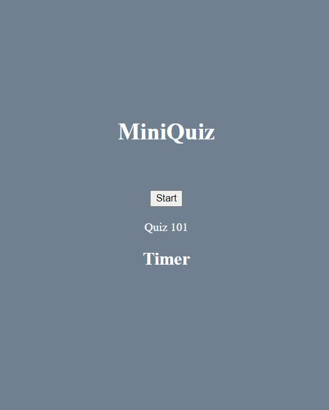

## Javascript-Quiz

## Deployed Link
https://daynelalmond.github.io/Javascript-Quiz/

## Screenshot

## Description

An attempt to create a javascript quiz. I have put a lot of comments to break down what I was trying to accomplish. However, I have spent a long time
on that function alone and have ultimately decided I will need to break it down into separated functions. I will continue to work on this.

## Description Update!

Managed to make a function chain that creates button elements to allow the user to choose the answer for the quiz. The timer will end the quiz if the interval is up
before the user finishes the quiz. The points are stored in local storage with only one line of code (JS line 78)!

## Features

Features are limited to starting a quiz to display a set of questions, a timer, and a score provided once finished.

