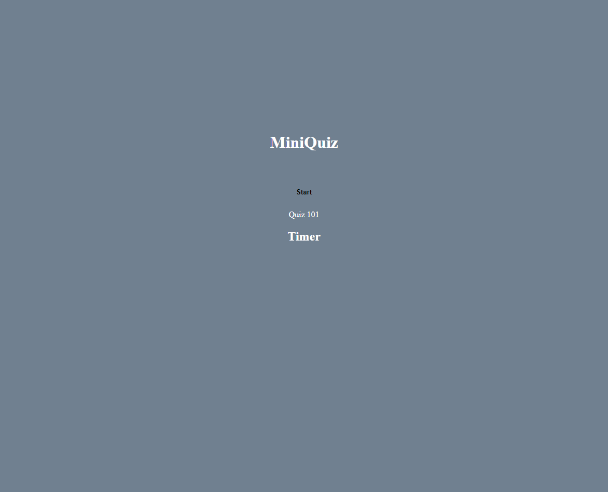

## Javascript-Quiz

## Deployed Link
https://daynelalmond.github.io/Javascript-Quiz/

## Screenshot

## Description

test your knowledge on coding terminology and javascript functions. As you take the quiz, the timer displayed will countdown. If you answer wrong, the timer will decrease more. Save your name and score to local storage. The timer will end the quiz by default if the interval is up before the quiz is complete.

## Features

Scores are stored in local storage, saving the input username as the key.

